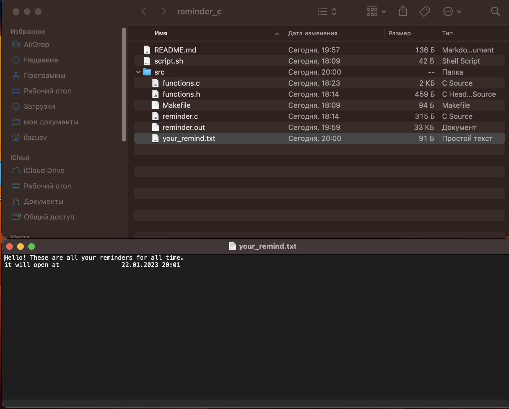
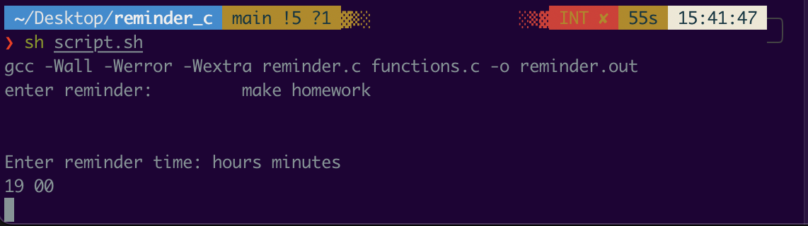
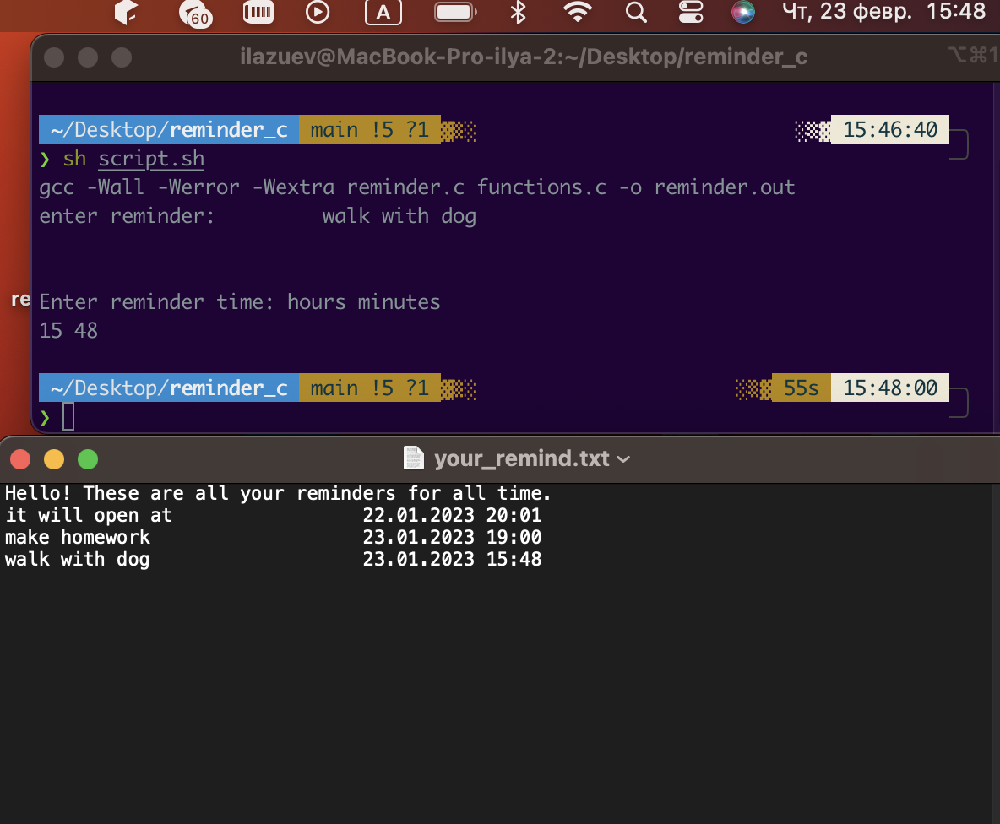

# console application: reminder

we made simple console app that can remember remind and whrite it in special file named your_remind.txt.

## available operating systems:
- macos
- linux

## How to run it?
To start the program you need to run script.sh
1. open your terminal
2. enter folder path
    >cd ../../reminder_c

3. run script.sh
    >sh script.sh

Thats all, now your program is working

## How does it works?

In the beginning, program asks you what you whant me to remember, then asks the time when you need to remind this note.

when the specified time comes, the file your_reminds.txt is opened, where all the notes are located.

